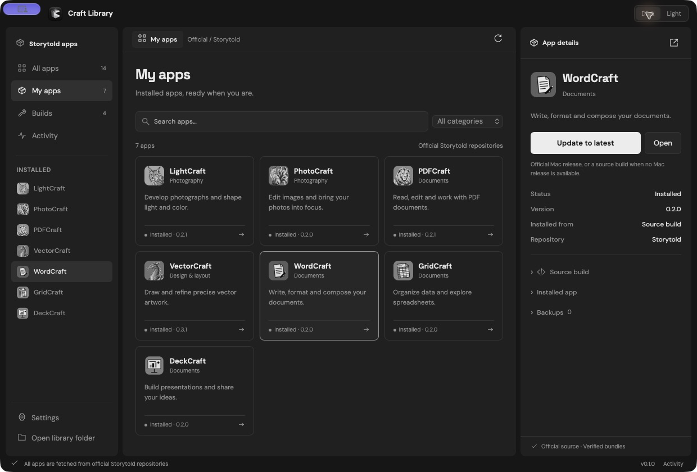
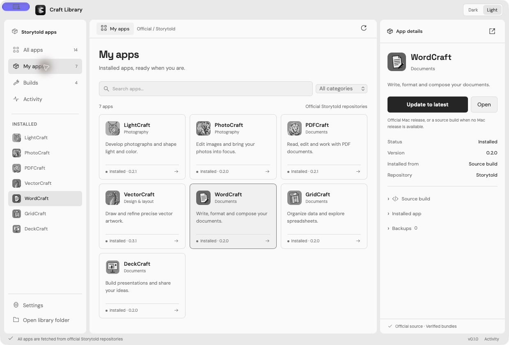

# Craft Library for macOS


Version **0.1.0**. A macOS desktop library for installing, updating and building the creative apps from [Storytold](https://github.com/orgs/storytold/repositories). This is **Henrik Øgård’s fork** of [CryptoKey98/craft-apps-manager](https://github.com/CryptoKey98/craft-apps-manager), with a redesigned macOS interface and native source builds for the complete Craft catalog. It is an independent project.

[This fork](https://github.com/henrikogaard/craft-apps-manager) · [Fork releases](https://github.com/henrikogaard/craft-apps-manager/releases) · [Report an issue](https://github.com/henrikogaard/craft-apps-manager/issues) · [macOS guide](docs/macos.md)

## What this fork adds

- A local web interface on macOS: monochrome graphite and light themes, searchable app cards, installed-app details, builds and activity in one window. Native Mac traffic lights and rounded window corners. No remote frontend or local web server is required.
- **Install latest** prefers the latest compatible official Mac release. When none exists, it fetches upstream main and builds a native `.app` from source.
- Native bundle recipes for all 14 catalog apps: the 12 Rust apps use their upstream packaging scripts; ArtCraft and ArtCraft X use their frontend builds and Tauri.
- Official source only. Existing preservation clones and the obsolete local repository setting are never used. Source downloads and build caches stay inside the manager’s own library.
- Installed version, release/source origin and exact source commit tracking. Persistent app backups can restore the previous bundle.
- Sparkle manager updates with automatic checks/downloads and a signed, notarized release workflow triggered by version tags.
- A new manager icon. Original upstream app icons are preserved in the source; the macOS interface displays them in monochrome.




The screenshot shows an installed macOS preview with a real local library. It does not prove that every upstream app builds successfully.

## Apps

DesignCraft, EffectCraft, FilmCraft, LightCraft, PhotoCraft, PDFCraft, VectorCraft, WordCraft, GridCraft, DeckCraft, CADCraft, SoundCraft, ArtCraft and ArtCraft X.

Apps and source archives always come from official `storytold/<app>` repositories. PDFCraft uses `storytold/pdfcraft` and the bundle name `PdfCraft.app`. ArtCraft has its own release naming and bundle identifier. ArtCraft X is experimental and currently has no published release.

## Install and use

Download a package from **this fork’s releases**, when one has been published. Upstream releases do not contain this fork’s changes. Until a fork release exists, build the manager locally:

```sh
cargo test --locked -- --test-threads=1
CRAFT_MANAGER_ARCH=arm64 ./scripts/package-macos.sh
```

Use `x64` for an Intel-only manager or omit `CRAFT_MANAGER_ARCH` for a universal build. A universal build requires both Rust Mac targets. See [macOS build instructions](docs/macos.md#building).

Open the DMG and drag `Craft Library.app` onto the Applications shortcut. Local packages default to ad-hoc signing. Tagged releases use Developer ID signing, Apple notarization and Sparkle update signatures. A quarantined download may require approval in macOS **System Settings → Privacy & Security**.

1. Choose an app from **All apps** or **My apps**.
2. Use **Install latest** to download a verified official release, or build official source when no compatible release exists. Close the Craft app before replacing it.
3. Use **Open** to launch an installed app. **Source build** contains tool setup, explicit `.app` builds and commit checks.
4. **Builds** lists completed local builds; **Activity** contains progress, errors, cancellation and logs.
5. **Settings** controls backups, source cleanup, selected apps and optional startup/hourly checks. Checks do not install apps automatically. Dark and Light controls persist your appearance choice.

A GitHub authentication/network error, checksum mismatch, invalid signature or Gatekeeper rejection stops release installation. Source fallback never bypasses failed release verification. Source builds depend on the upstream project and its dependencies compiling on your machine; local builds are ad-hoc signed, not notarized releases.

## Library and dependencies

macOS data lives in `~/Library/Application Support/Craft Apps Manager`:

```text
releases/           Downloaded releases and portable apps
sources/            Official source archives and exact commit index
builds/             Completed source builds and provenance
workspace/          Extracted source, dependency tools and compilation caches
backups/            Previous app versions and source archives
logs/               Build, installation and check logs
ui-settings.json    Graphite / light appearance choice
```

Rust and Xcode Command Line Tools are needed for source builds. **Set up tools** installs relevant prerequisites through Homebrew and the manager’s own tool folder. PhotoCraft needs libheif; ArtCraft builds need Node.js/npm, CMake, NASM, LLVM, pkg-config and Tauri CLI 2. The `craft-fonts` repository is fetched from official GitHub into the manager’s workspace. Your separately saved repositories remain independent.

For deterministic, headless macOS operations:

```sh
craft-apps-manager --build-app wordcraft --latest
craft-apps-manager --install-build wordcraft
craft-apps-manager --install-latest artcraft
```

Omit `--latest` to rebuild the manager’s previously downloaded, checksum-verified official source archive. Use `--root /absolute/path` for a separate library.

## Development and platform scope

The backend is Rust. macOS uses [Wry](https://github.com/tauri-apps/wry) and [Tao](https://github.com/tauri-apps/tao) to embed `src/web/index.html`; frontend assets and fonts are bundled locally. This fork is macOS only. The inherited Windows/Linux UI, installers, platform modules and packaging have been removed. Native menus use Muda, including **Craft Library → About Craft Library** with the app icon, version and Henrik Øgård.

```sh
cargo fmt --check
cargo test --locked -- --test-threads=1
cargo clippy --locked --all-targets -- -D warnings
cargo build --release --locked
```

See [macOS](docs/macos.md) for signing, source builds, backups and manager updates. See [architecture and repository layout](docs/architecture.md), [review evidence](docs/review.md), and the [signed releases and Sparkle](docs/releases.md). Sparkle updates use this fork’s release appcast, configured in `config/sparkle.json`. `CRAFT_MANAGER_REPOSITORY=owner/name` changes repository links and release publication; set `SPARKLE_FEED_URL` separately when distributing another fork. This setting never changes the official repositories used for Craft apps.

## Credits and license

Original Craft Apps Manager by [CryptoKey98 and the original contributors](https://github.com/CryptoKey98/craft-apps-manager). Fork changes by **Henrik Øgård**. [MIT license](LICENSE), with both copyright notices retained. Upstream app icons and interface fonts have their own notices in [THIRD-PARTY-NOTICES.txt](THIRD-PARTY-NOTICES.txt).
